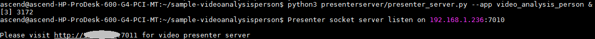

Developers can deploy the application on the Atlas 200 DK AI acceleration cloud server to decode the local MP4 file or RTSP video streams, detect pedestrians, and human faces in video frames, predict their attributes, generate structured information, and send the structured information to the server for storage and display.

## Prerequisites<a name="en-us_topic_0167344118_section412314183119"></a>

Before using an open source application, ensure that:

-   Mind Studio has been installed. For details, see  [Mind Studio Installation Guide](https://www.huawei.com/minisite/ascend/en/filedetail_1.html).
-   The Atlas 200 DK developer board has been connected to Mind Studio, the cross compiler has been installed, the SD card has been prepared, and basic information has been configured. For details, see  [Atlas 200 DK User Guide](https://www.huawei.com/minisite/ascend/en/filedetail_2.html).

## Software Preparation<a name="en-us_topic_0167344118_section431629175317"></a>

Before running the application, obtain the source code package and configure the environment as follows.

1.  Obtain the source code package.

    Download all the code in the sample-facedetection repository at  [https://github.com/Ascend/sample-videoanalysisperson](https://github.com/Ascend/sample-videoanalysisperson)  to any directory on Ubuntu Server where Mind Studio is located as the Mind Studio installation user, for example,  _/home/ascend/sample-videoanalysisperson_.

2.  Log in to Ubuntu Server where Mind Studio is located as the Mind Studio installation user and set the environment variable  **DDK\_HOME**.

    **vim \~/.bashrc**

    Run the following commands to add the environment variables  **DDK\_HOME**  and  **LD\_LIBRARY\_PATH**  to the last line:

    **export DDK\_HOME=/home/XXX/tools/che/ddk/ddk**

    **export LD\_LIBRARY\_PATH=$DDK\_HOME/uihost/lib**

    > **NOTE:**   
    >-   **XXX**  indicates the Mind Studio installation user, and  **/home/XXX/tools**  indicates the default installation path of the DDK.  
    >-   If the environment variables have been added, skip this step.  

    Enter  **:wq!**  to save and exit.

    Run the following command for the environment variable to take effect:

    **source \~/.bashrc**


## Deployment<a name="en-us_topic_0167344118_section254863302012"></a>

1.  Access the root directory where the video analysis application code is located as the Mind Studio installation user, for example,  _**/home/ascend/sample-videoanalysisperson**_
2.  <a name="en-us_topic_0167344118_li08019112542"></a>Run the deployment script to prepare the project environment, including compiling and deploying the ascenddk public library, downloading the network model, and configuring Presenter Server.

    **bash deploy.sh** _host\_ip_ _model\_mode_

    -   _host\_ip_: For the Atlas 200 DK developer board, this parameter indicates the IP address of the developer board.For the AI acceleration cloud server, this parameter indicates the IP address of the host.

    -   _model\_mode_  indicates the deployment mode of the model file. The value can be  **local**  or **internet**. The default setting is  **internet**.
        -   **local**: If the Ubuntu system where Mind Studio is located is not connected to the network, use the local mode. In this case, you need to have downloaded the model file and the dependent common code library to the  **sample-videoanalysisperson/script**  directory by referring to  [Downloading Network Models and Dependency Code Library](#en-us_topic_0167344118_section083811318334).
        -   **internet**: If the Ubuntu system where Mind Studio is located is connected to the network, use the Internet mode. In this case, download the model file and  dependency code library online.


    Example command:

    **bash deploy.sh 192.168.1.2 internet**

    -   When the message  **Please choose one to show the presenter in browser\(default: 127.0.0.1\):**  is displayed, enter the IP address used for accessing the Presenter Server service in the browser. Generally, the IP address is the IP address for accessing the Mind Studio service.
    -   When the message  **Please input a absolute path to storage video analysis data:**  is displayed, enter the existing absolute path for storing video analysis data in Mind Studio. The Mind Studio user must have the read and write permissions.

    Select the IP address used by the browser to access the Presenter Server service in  **Current environment valid ip list**  and enter the path for storing video analysis data, as shown in  [Figure 1](#en-us_topic_0167344118_fig184321447181017).

    **Figure  1**  Project deployment<a name="en-us_topic_0167344118_fig184321447181017"></a>  
    

3.  <a name="en-us_topic_0167344118_li499911453439"></a>Start Presenter Server.

    Run the following command to start the Presenter Server program of the video analysis application in the background:

    **python3 presenterserver/presenter\_server.py --app video\_analysis\_person &**

    > **NOTE:**   
    >**presenter\_server.py**  is located in the  **presenterserve**  directory. You can run the  **python3 presenter\_server.py -h**  or  **python3 presenter\_server.py --help**  command in this directory to view the usage method of  **presenter\_server.py**.  

    [Figure 2](#en-us_topic_0167344118_fig69531305324)  shows that the presenter\_server service is started successfully.

    **Figure  2**  Starting the Presenter Server process<a name="en-us_topic_0167344118_fig69531305324"></a>  
    

    Use the URL shown in the preceding figure to log in to Presenter Server \(only the Chrome browser is supported\). The IP address is that entered in  [2](#en-us_topic_0167344118_li08019112542)  and the default port number is  **7005**. The following figure indicates that Presenter Server is started successfully.

    **Figure  3**  Home page<a name="en-us_topic_0167344118_fig64391558352"></a>  
    

4.  The video structured application can parse local videos and RTSP video streams.
    -   To parse a local video, upload the video file to the Host.

        For example, upload the video file  **person.mp4**  to the  **/home/HwHiAiUser/sample**  directory on the host.

        > **NOTE:**   
        >H.264 and H.265 MP4 files are supported. If an MP4 file needs to be edited, you are advised to use FFmpeg. If a video file is edited by other tools, FFmpeg may fail to parse the file.  

    -   If only RTSP video streams need to be parsed, skip this step.


## Running<a name="en-us_topic_0167344118_section2044213563203"></a>

1.  Run the video analysis application.

    Run the following command in the  **/home/ascend/sample-videoanalysiscar**  directory to start the video analysis application:

    **bash run\_videoanalysispersonapp.sh** _host\_ip_ _ __presenter\_view\_appname__ channel1_ _\[channel2\]_  &

    -   _host\_ip_: For the Atlas 200 DK developer board, this parameter indicates the IP address of the developer board.For the AI acceleration cloud server, this parameter indicates the IP address of the host.
    -   _presenter\_view\_app\_name_: Indicates  **View Name**  displayed on the Presenter Server page, which is user-defined.
    -   _channel1_: absolute path of a video file on the host
    -   _channel2_: URL of an RTSP video stream

    Example command:

    **bash run\_videoanalysispersonapp.sh 192.168.1.2 video /home/HwHiAiUser/sample/person.mp4 &**

2.  Use the URL that is displayed when you start the Presenter Server service to log in to the Presenter Server website \(only the Chrome browser is supported\). For details, see  [3](#en-us_topic_0167344118_li499911453439).

    > **NOTE:**   
    >The Presenter Server of the video analysis application supports the display of a maximum of two  _presenter\_view\_app\_name_  at the same time.  

    The navigation tree on the left displays the app name and channel name of the video. The large image of the extracted video frame and the detected target small image are displayed in the middle. After you click the small image, the detailed inference result and score are displayed on the right.

    This application supports human body attribute detection, and facial attribute detection.

    -   Human body attributes include:

        Ages \(ages 16–30, 31–45, 46–60 as well as 61 and above\); Backpack; Carrying other; Casual lower; Casual upper; Formal lower; Hat; Jacket; Jeans; Leather Shoes; Logo; Short hair/Long hair; Male/Female; Messenger Bag; Muffler; No accessory; No carrying; Plaid; Plastic bags; Sandals; Shoes; Shorts; Short Sleeve; Skirt; Sneaker; Stripes; Sunglasses; Trousers; T-shirt; Upper other; V-Neck.

        In the detailed inference result display area on the video analysis interface,  **Age**,  **Male/Female**, and  **Short hair/Long hair**  are mandatory. Other attributes are displayed only when the confidence level is greater than 0.5.

    -   Facial attribute detection supports age and gender identification.


## Follow-up Operations<a name="en-us_topic_0167344118_section1092612277429"></a>

-   **Stopping the Video Structured Analysis Application**

    To stop the video analysis application, perform the following operations:

    Run the following command in the  **sample-videoanalysisperson**  directory as the Mind Studio installation user:

    **bash stop\_videoanalysispersonapp.sh** _host\_ip_

    _host\_ip_: For the Atlas 200 DK developer board, this parameter indicates the IP address of the developer board.For the AI acceleration cloud server, this parameter indicates the IP address of the host.

    Example command:

    **bash stop\_videoanalysispersonapp.sh** _192.168.1.2_

-   **Stopping the Presenter Server Service**

    The Presenter Server service is always in the running state after being started. To stop the Presenter Server service of the video structured analysis application, perform the following operations:

    Run the following command to check the process of the Presenter Server service corresponding to the video structured analysis application as the Mind Studio installation user:

    **ps -ef | grep presenter | grep video\_analysis\_person**

    ```
    ascend@ascend-HP-ProDesk-600-G4-PCI-MT:~/sample-videoanalysisperson$ ps -ef | grep presenter | grep video_analysis_car
    ascend 3656 20313 0 15:10 pts/24?? 00:00:00 python3 presenterserver/presenter_server.py --app video_analysis_person
    ```

    In the preceding information,  _3656_  indicates the process ID of the Presenter Server service corresponding to the facial recognition application.

    To stop the service, run the following command:

    **kill -9** _3656_


## Downloading Network Models and Dependency Code Library<a name="en-us_topic_0167344118_section083811318334"></a>

-   Downloading network model

    The models used in the Ascend DK open source applications are converted models that adapt to the Ascend 310 chipset. For details about how to download this kind of models and the original network models, see  [Table 1](#en-us_topic_0167344118_table0531392153). If you have a better model solution, you are welcome to share it at  [https://github.com/Ascend/models](https://github.com/Ascend/models).

    **Table  1**  Models used in Atlas DK open source applications

    <a name="en-us_topic_0167344118_table0531392153"></a>
    <table><thead align="left"><tr id="en-us_topic_0167344118_row1154103991514"><th class="cellrowborder" valign="top" width="15.841584158415841%" id="mcps1.2.5.1.1"><p id="en-us_topic_0167344118_p195418397155"><a name="en-us_topic_0167344118_p195418397155"></a><a name="en-us_topic_0167344118_p195418397155"></a>Model Name</p>
    </th>
    <th class="cellrowborder" valign="top" width="21.782178217821784%" id="mcps1.2.5.1.2"><p id="en-us_topic_0167344118_p1054539151519"><a name="en-us_topic_0167344118_p1054539151519"></a><a name="en-us_topic_0167344118_p1054539151519"></a>Description</p>
    </th>
    <th class="cellrowborder" valign="top" width="28.71287128712871%" id="mcps1.2.5.1.3"><p id="en-us_topic_0167344118_p387083117108"><a name="en-us_topic_0167344118_p387083117108"></a><a name="en-us_topic_0167344118_p387083117108"></a>Model Download Path</p>
    </th>
    <th class="cellrowborder" valign="top" width="33.663366336633665%" id="mcps1.2.5.1.4"><p id="en-us_topic_0167344118_p35412397154"><a name="en-us_topic_0167344118_p35412397154"></a><a name="en-us_topic_0167344118_p35412397154"></a>Original Network Download Address</p>
    </th>
    </tr>
    </thead>
    <tbody><tr id="en-us_topic_0167344118_row12438171711497"><td class="cellrowborder" valign="top" width="15.841584158415841%" headers="mcps1.2.5.1.1 "><p id="en-us_topic_0167344118_p17544398153"><a name="en-us_topic_0167344118_p17544398153"></a><a name="en-us_topic_0167344118_p17544398153"></a>Network model for face detection</p>
    <p id="en-us_topic_0167344118_p84114461512"><a name="en-us_topic_0167344118_p84114461512"></a><a name="en-us_topic_0167344118_p84114461512"></a>(<strong id="en-us_topic_0167344118_b41111030191911"><a name="en-us_topic_0167344118_b41111030191911"></a><a name="en-us_topic_0167344118_b41111030191911"></a>face_detection.om</strong>)</p>
    </td>
    <td class="cellrowborder" valign="top" width="21.782178217821784%" headers="mcps1.2.5.1.2 "><p id="en-us_topic_0167344118_p1372429181516"><a name="en-us_topic_0167344118_p1372429181516"></a><a name="en-us_topic_0167344118_p1372429181516"></a>It is a network model converted from ResNet0-SSD300 model based on Caffe.</p>
    </td>
    <td class="cellrowborder" valign="top" width="28.71287128712871%" headers="mcps1.2.5.1.3 "><p id="en-us_topic_0167344118_p1569513572242"><a name="en-us_topic_0167344118_p1569513572242"></a><a name="en-us_topic_0167344118_p1569513572242"></a>Download the model from the <strong id="en-us_topic_0167344118_b028612482311"><a name="en-us_topic_0167344118_b028612482311"></a><a name="en-us_topic_0167344118_b028612482311"></a>computer_vision/object_detect/face_detection</strong> directory in the <a href="https://github.com/Ascend/models/" target="_blank" rel="noopener noreferrer">https://github.com/Ascend/models/</a> repository.</p>
    <p id="en-us_topic_0167344118_p1787118315101"><a name="en-us_topic_0167344118_p1787118315101"></a><a name="en-us_topic_0167344118_p1787118315101"></a>For the version description, see the <strong id="en-us_topic_0167344118_b1012219832511"><a name="en-us_topic_0167344118_b1012219832511"></a><a name="en-us_topic_0167344118_b1012219832511"></a>README.md</strong> file in the current directory.</p>
    </td>
    <td class="cellrowborder" valign="top" width="33.663366336633665%" headers="mcps1.2.5.1.4 "><p id="en-us_topic_0167344118_p1785381617217"><a name="en-us_topic_0167344118_p1785381617217"></a><a name="en-us_topic_0167344118_p1785381617217"></a>For details, see the <strong id="en-us_topic_0167344118_b1423252411265"><a name="en-us_topic_0167344118_b1423252411265"></a><a name="en-us_topic_0167344118_b1423252411265"></a>README.md</strong> file of the <strong id="en-us_topic_0167344118_b688544332614"><a name="en-us_topic_0167344118_b688544332614"></a><a name="en-us_topic_0167344118_b688544332614"></a>computer_vision/object_detect/face_detection</strong> directory in the <a href="https://github.com/Ascend/models/" target="_blank" rel="noopener noreferrer">https://github.com/Ascend/models/</a> repository.</p>
    <p id="en-us_topic_0167344118_p1314312124919"><a name="en-us_topic_0167344118_p1314312124919"></a><a name="en-us_topic_0167344118_p1314312124919"></a><strong id="en-us_topic_0167344118_b1365251225519"><a name="en-us_topic_0167344118_b1365251225519"></a><a name="en-us_topic_0167344118_b1365251225519"></a>Precautions during model conversion:</strong></p>
    <p id="en-us_topic_0167344118_p53116302463"><a name="en-us_topic_0167344118_p53116302463"></a><a name="en-us_topic_0167344118_p53116302463"></a>During the conversion, a message is displayed indicating that the conversion fails. You only need to select <strong id="en-us_topic_0167344118_b55978299556"><a name="en-us_topic_0167344118_b55978299556"></a><a name="en-us_topic_0167344118_b55978299556"></a>SSDDetectionOutput </strong>from the drop-down list box for the last layer and click <strong id="en-us_topic_0167344118_b15597182918551"><a name="en-us_topic_0167344118_b15597182918551"></a><a name="en-us_topic_0167344118_b15597182918551"></a>Retry</strong>.</p>
    <p id="en-us_topic_0167344118_p109405475158"><a name="en-us_topic_0167344118_p109405475158"></a><a name="en-us_topic_0167344118_p109405475158"></a><a name="en-us_topic_0167344118_image13957135893610"></a><a name="en-us_topic_0167344118_image13957135893610"></a><span></span></p>
    <p id="en-us_topic_0167344118_p179225194910"><a name="en-us_topic_0167344118_p179225194910"></a><a name="en-us_topic_0167344118_p179225194910"></a></p>
    </td>
    </tr>
    <tr id="en-us_topic_0167344118_row575065710347"><td class="cellrowborder" valign="top" width="15.841584158415841%" headers="mcps1.2.5.1.1 "><p id="en-us_topic_0167344118_p768019443514"><a name="en-us_topic_0167344118_p768019443514"></a><a name="en-us_topic_0167344118_p768019443514"></a>Network model for performing inference on human body features (<strong id="en-us_topic_0167344118_b179721525173814"><a name="en-us_topic_0167344118_b179721525173814"></a><a name="en-us_topic_0167344118_b179721525173814"></a>pedestrian.om</strong>)</p>
    </td>
    <td class="cellrowborder" valign="top" width="21.782178217821784%" headers="mcps1.2.5.1.2 "><p id="en-us_topic_0167344118_p887812590385"><a name="en-us_topic_0167344118_p887812590385"></a><a name="en-us_topic_0167344118_p887812590385"></a>It is a VeSPA model based on Caffe.</p>
    </td>
    <td class="cellrowborder" valign="top" width="28.71287128712871%" headers="mcps1.2.5.1.3 "><p id="en-us_topic_0167344118_p815140185614"><a name="en-us_topic_0167344118_p815140185614"></a><a name="en-us_topic_0167344118_p815140185614"></a>Download the model from the <strong id="en-us_topic_0167344118_b14263561419"><a name="en-us_topic_0167344118_b14263561419"></a><a name="en-us_topic_0167344118_b14263561419"></a>computer_vision/classification/pedestrian</strong> directory in the <a href="https://github.com/Ascend/models/" target="_blank" rel="noopener noreferrer">https://github.com/Ascend/models/</a> repository.</p>
    <p id="en-us_topic_0167344118_p12151140105620"><a name="en-us_topic_0167344118_p12151140105620"></a><a name="en-us_topic_0167344118_p12151140105620"></a>For the version description, see the <strong id="en-us_topic_0167344118_b155841647174115"><a name="en-us_topic_0167344118_b155841647174115"></a><a name="en-us_topic_0167344118_b155841647174115"></a>README.md</strong> file in the current directory.</p>
    </td>
    <td class="cellrowborder" valign="top" width="33.663366336633665%" headers="mcps1.2.5.1.4 "><p id="en-us_topic_0167344118_p111534014560"><a name="en-us_topic_0167344118_p111534014560"></a><a name="en-us_topic_0167344118_p111534014560"></a>For details, see the <strong id="en-us_topic_0167344118_b17934117144215"><a name="en-us_topic_0167344118_b17934117144215"></a><a name="en-us_topic_0167344118_b17934117144215"></a>README.md</strong> file of the <strong id="en-us_topic_0167344118_b1393417184211"><a name="en-us_topic_0167344118_b1393417184211"></a><a name="en-us_topic_0167344118_b1393417184211"></a>computer_vision/classification/pedestrian</strong> directory in the <a href="https://github.com/Ascend/models/" target="_blank" rel="noopener noreferrer">https://github.com/Ascend/models/</a> repository.</p>
    </td>
    </tr>
    <tr id="en-us_topic_0167344118_row97601212196"><td class="cellrowborder" valign="top" width="15.841584158415841%" headers="mcps1.2.5.1.1 "><p id="en-us_topic_0167344118_p67609181917"><a name="en-us_topic_0167344118_p67609181917"></a><a name="en-us_topic_0167344118_p67609181917"></a>Network model for identifying the age (<strong id="en-us_topic_0167344118_b14920191414415"><a name="en-us_topic_0167344118_b14920191414415"></a><a name="en-us_topic_0167344118_b14920191414415"></a>inception_age.om</strong>)</p>
    </td>
    <td class="cellrowborder" valign="top" width="21.782178217821784%" headers="mcps1.2.5.1.2 "><p id="en-us_topic_0167344118_p138799112017"><a name="en-us_topic_0167344118_p138799112017"></a><a name="en-us_topic_0167344118_p138799112017"></a>It is an Inception V3 model based on TensorFlow.</p>
    </td>
    <td class="cellrowborder" valign="top" width="28.71287128712871%" headers="mcps1.2.5.1.3 "><p id="en-us_topic_0167344118_p143172219204"><a name="en-us_topic_0167344118_p143172219204"></a><a name="en-us_topic_0167344118_p143172219204"></a>Download the model from the <strong id="en-us_topic_0167344118_b6148348417"><a name="en-us_topic_0167344118_b6148348417"></a><a name="en-us_topic_0167344118_b6148348417"></a>computer_vision/classification/inception_age</strong> directory in the <a href="https://github.com/Ascend/models/" target="_blank" rel="noopener noreferrer">https://github.com/Ascend/models/</a> repository.</p>
    <p id="en-us_topic_0167344118_p53182210209"><a name="en-us_topic_0167344118_p53182210209"></a><a name="en-us_topic_0167344118_p53182210209"></a>For the version description, see the <strong id="en-us_topic_0167344118_b875610501548"><a name="en-us_topic_0167344118_b875610501548"></a><a name="en-us_topic_0167344118_b875610501548"></a>README.md</strong> file in the current directory.</p>
    </td>
    <td class="cellrowborder" valign="top" width="33.663366336633665%" headers="mcps1.2.5.1.4 "><p id="en-us_topic_0167344118_p47600161920"><a name="en-us_topic_0167344118_p47600161920"></a><a name="en-us_topic_0167344118_p47600161920"></a>For details, see the <strong id="en-us_topic_0167344118_b172916551744"><a name="en-us_topic_0167344118_b172916551744"></a><a name="en-us_topic_0167344118_b172916551744"></a>README.md</strong> file of the <strong id="en-us_topic_0167344118_b172920554415"><a name="en-us_topic_0167344118_b172920554415"></a><a name="en-us_topic_0167344118_b172920554415"></a>computer_vision/classification/inception_age</strong> directory in the <a href="https://github.com/Ascend/models/" target="_blank" rel="noopener noreferrer">https://github.com/Ascend/models/</a> repository.</p>
    </td>
    </tr>
    <tr id="en-us_topic_0167344118_row2728646172016"><td class="cellrowborder" valign="top" width="15.841584158415841%" headers="mcps1.2.5.1.1 "><p id="en-us_topic_0167344118_p672814672011"><a name="en-us_topic_0167344118_p672814672011"></a><a name="en-us_topic_0167344118_p672814672011"></a>Network model for identifying the gender (<strong id="en-us_topic_0167344118_b74414295515"><a name="en-us_topic_0167344118_b74414295515"></a><a name="en-us_topic_0167344118_b74414295515"></a>inception_gender.om</strong>)</p>
    </td>
    <td class="cellrowborder" valign="top" width="21.782178217821784%" headers="mcps1.2.5.1.2 "><p id="en-us_topic_0167344118_p281361717216"><a name="en-us_topic_0167344118_p281361717216"></a><a name="en-us_topic_0167344118_p281361717216"></a>It is an Inception V3 model based on TensorFlow.</p>
    </td>
    <td class="cellrowborder" valign="top" width="28.71287128712871%" headers="mcps1.2.5.1.3 "><p id="en-us_topic_0167344118_p1310692316215"><a name="en-us_topic_0167344118_p1310692316215"></a><a name="en-us_topic_0167344118_p1310692316215"></a>Download the model from the <strong id="en-us_topic_0167344118_b182012344515"><a name="en-us_topic_0167344118_b182012344515"></a><a name="en-us_topic_0167344118_b182012344515"></a>computer_vision/classification/inception_gender</strong> directory in the <a href="https://github.com/Ascend/models/" target="_blank" rel="noopener noreferrer">https://github.com/Ascend/models/</a> repository.</p>
    <p id="en-us_topic_0167344118_p1610632315215"><a name="en-us_topic_0167344118_p1610632315215"></a><a name="en-us_topic_0167344118_p1610632315215"></a>For the version description, see the <strong id="en-us_topic_0167344118_b346724414514"><a name="en-us_topic_0167344118_b346724414514"></a><a name="en-us_topic_0167344118_b346724414514"></a>README.md</strong> file in the current directory.</p>
    </td>
    <td class="cellrowborder" valign="top" width="33.663366336633665%" headers="mcps1.2.5.1.4 "><p id="en-us_topic_0167344118_p272824618207"><a name="en-us_topic_0167344118_p272824618207"></a><a name="en-us_topic_0167344118_p272824618207"></a>For details, see the <strong id="en-us_topic_0167344118_b488910462515"><a name="en-us_topic_0167344118_b488910462515"></a><a name="en-us_topic_0167344118_b488910462515"></a>README.md</strong> file of the <strong id="en-us_topic_0167344118_b16889204620515"><a name="en-us_topic_0167344118_b16889204620515"></a><a name="en-us_topic_0167344118_b16889204620515"></a>computer_vision/classification/inception_gender</strong> directory in the <a href="https://github.com/Ascend/models/" target="_blank" rel="noopener noreferrer">https://github.com/Ascend/models/</a> repository.</p>
    </td>
    </tr>
    <tr id="en-us_topic_0167344118_row1660215954717"><td class="cellrowborder" valign="top" width="15.841584158415841%" headers="mcps1.2.5.1.1 "><p id="en-us_topic_0167344118_p171992239483"><a name="en-us_topic_0167344118_p171992239483"></a><a name="en-us_topic_0167344118_p171992239483"></a>Network model for object detection</p>
    <p id="en-us_topic_0167344118_p819972319483"><a name="en-us_topic_0167344118_p819972319483"></a><a name="en-us_topic_0167344118_p819972319483"></a>(<strong id="en-us_topic_0167344118_b14199172384814"><a name="en-us_topic_0167344118_b14199172384814"></a><a name="en-us_topic_0167344118_b14199172384814"></a>vgg_ssd.om</strong>)</p>
    </td>
    <td class="cellrowborder" valign="top" width="21.782178217821784%" headers="mcps1.2.5.1.2 "><p id="en-us_topic_0167344118_p9199423164811"><a name="en-us_topic_0167344118_p9199423164811"></a><a name="en-us_topic_0167344118_p9199423164811"></a>It is an SSD512 model based on Caffe.</p>
    </td>
    <td class="cellrowborder" valign="top" width="28.71287128712871%" headers="mcps1.2.5.1.3 "><p id="en-us_topic_0167344118_p19199923104817"><a name="en-us_topic_0167344118_p19199923104817"></a><a name="en-us_topic_0167344118_p19199923104817"></a>Download the model from the <strong id="en-us_topic_0167344118_b101991223134816"><a name="en-us_topic_0167344118_b101991223134816"></a><a name="en-us_topic_0167344118_b101991223134816"></a>computer_vision/object_detect/vgg_ssd</strong> directory in the <a href="https://github.com/Ascend/models/" target="_blank" rel="noopener noreferrer">https://github.com/Ascend/models/</a> repository.</p>
    <p id="en-us_topic_0167344118_p12199123144811"><a name="en-us_topic_0167344118_p12199123144811"></a><a name="en-us_topic_0167344118_p12199123144811"></a>For the version description, see the <strong id="en-us_topic_0167344118_b3199423154814"><a name="en-us_topic_0167344118_b3199423154814"></a><a name="en-us_topic_0167344118_b3199423154814"></a>README.md</strong> file in the current directory.</p>
    </td>
    <td class="cellrowborder" valign="top" width="33.663366336633665%" headers="mcps1.2.5.1.4 "><p id="en-us_topic_0167344118_p122001623144820"><a name="en-us_topic_0167344118_p122001623144820"></a><a name="en-us_topic_0167344118_p122001623144820"></a>For details, see the <strong id="en-us_topic_0167344118_b520019232482"><a name="en-us_topic_0167344118_b520019232482"></a><a name="en-us_topic_0167344118_b520019232482"></a>README.md</strong> file of the <strong id="en-us_topic_0167344118_b92001223114815"><a name="en-us_topic_0167344118_b92001223114815"></a><a name="en-us_topic_0167344118_b92001223114815"></a>computer_vision/object_detect/vgg_ssd</strong> directory in the <a href="https://github.com/Ascend/models/" target="_blank" rel="noopener noreferrer">https://github.com/Ascend/models/</a> repository.</p>
    </td>
    </tr>
    </tbody>
    </table>

-   Download the dependent software library

    **Table  2**  Download the dependent software library

    <a name="en-us_topic_0167344118_table141761431143110"></a>
    <table><thead align="left"><tr id="en-us_topic_0167344118_row18177103183119"><th class="cellrowborder" valign="top" width="33.33333333333333%" id="mcps1.2.4.1.1"><p id="en-us_topic_0167344118_p8177331103112"><a name="en-us_topic_0167344118_p8177331103112"></a><a name="en-us_topic_0167344118_p8177331103112"></a>Module Name</p>
    </th>
    <th class="cellrowborder" valign="top" width="33.33333333333333%" id="mcps1.2.4.1.2"><p id="en-us_topic_0167344118_p1317753119313"><a name="en-us_topic_0167344118_p1317753119313"></a><a name="en-us_topic_0167344118_p1317753119313"></a>Module Description</p>
    </th>
    <th class="cellrowborder" valign="top" width="33.33333333333333%" id="mcps1.2.4.1.3"><p id="en-us_topic_0167344118_p1417713111311"><a name="en-us_topic_0167344118_p1417713111311"></a><a name="en-us_topic_0167344118_p1417713111311"></a>Download Address</p>
    </th>
    </tr>
    </thead>
    <tbody><tr id="en-us_topic_0167344118_row19177133163116"><td class="cellrowborder" valign="top" width="33.33333333333333%" headers="mcps1.2.4.1.1 "><p id="en-us_topic_0167344118_p2017743119318"><a name="en-us_topic_0167344118_p2017743119318"></a><a name="en-us_topic_0167344118_p2017743119318"></a>EZDVPP</p>
    </td>
    <td class="cellrowborder" valign="top" width="33.33333333333333%" headers="mcps1.2.4.1.2 "><p id="en-us_topic_0167344118_p52110611584"><a name="en-us_topic_0167344118_p52110611584"></a><a name="en-us_topic_0167344118_p52110611584"></a>Encapsulates the dvpp interface and provides image and video processing capabilities, such as color gamut conversion and image / video conversion</p>
    </td>
    <td class="cellrowborder" valign="top" width="33.33333333333333%" headers="mcps1.2.4.1.3 "><p id="en-us_topic_0167344118_p31774315318"><a name="en-us_topic_0167344118_p31774315318"></a><a name="en-us_topic_0167344118_p31774315318"></a><a href="https://github.com/Ascend/sdk-ezdvpp" target="_blank" rel="noopener noreferrer">https://github.com/Ascend/sdk-ezdvpp</a></p>
    <p id="en-us_topic_0167344118_p1634523015710"><a name="en-us_topic_0167344118_p1634523015710"></a><a name="en-us_topic_0167344118_p1634523015710"></a>After the download, keep the folder name <span class="filepath" id="en-us_topic_0167344118_filepath1324864613582"><a name="en-us_topic_0167344118_filepath1324864613582"></a><a name="en-us_topic_0167344118_filepath1324864613582"></a><b>sdk-ezdvpp</b></span>。</p>
    </td>
    </tr>
    <tr id="en-us_topic_0167344118_row101773315313"><td class="cellrowborder" valign="top" width="33.33333333333333%" headers="mcps1.2.4.1.1 "><p id="en-us_topic_0167344118_p217773153110"><a name="en-us_topic_0167344118_p217773153110"></a><a name="en-us_topic_0167344118_p217773153110"></a>Presenter Agent</p>
    </td>
    <td class="cellrowborder" valign="top" width="33.33333333333333%" headers="mcps1.2.4.1.2 "><p id="en-us_topic_0167344118_p19431399359"><a name="en-us_topic_0167344118_p19431399359"></a><a name="en-us_topic_0167344118_p19431399359"></a><span>API for interacting with the Presenter Server</span>.</p>
    </td>
    <td class="cellrowborder" valign="top" width="33.33333333333333%" headers="mcps1.2.4.1.3 "><p id="en-us_topic_0167344118_p16684144715560"><a name="en-us_topic_0167344118_p16684144715560"></a><a name="en-us_topic_0167344118_p16684144715560"></a><a href="https://github.com/Ascend/sdk-presenter/tree/master/presenteragent" target="_blank" rel="noopener noreferrer">https://github.com/Ascend/sdk-presenter/tree/master/presenteragent</a></p>
    <p id="en-us_topic_0167344118_p82315442578"><a name="en-us_topic_0167344118_p82315442578"></a><a name="en-us_topic_0167344118_p82315442578"></a>After the download, keep the folder name <span class="filepath" id="en-us_topic_0167344118_filepath19800155745817"><a name="en-us_topic_0167344118_filepath19800155745817"></a><a name="en-us_topic_0167344118_filepath19800155745817"></a><b>presenteragent</b></span>.</p>
    </td>
    </tr>
    <tr id="en-us_topic_0167344118_row119002017360"><td class="cellrowborder" valign="top" width="33.33333333333333%" headers="mcps1.2.4.1.1 "><p id="en-us_topic_0167344118_p1390111083619"><a name="en-us_topic_0167344118_p1390111083619"></a><a name="en-us_topic_0167344118_p1390111083619"></a>FFmpeg code</p>
    </td>
    <td class="cellrowborder" valign="top" width="33.33333333333333%" headers="mcps1.2.4.1.2 "><p id="en-us_topic_0167344118_p29013043617"><a name="en-us_topic_0167344118_p29013043617"></a><a name="en-us_topic_0167344118_p29013043617"></a>The current application uses FFmpeg to decapsulate video files.</p>
    </td>
    <td class="cellrowborder" valign="top" width="33.33333333333333%" headers="mcps1.2.4.1.3 "><p id="en-us_topic_0167344118_p72741933193610"><a name="en-us_topic_0167344118_p72741933193610"></a><a name="en-us_topic_0167344118_p72741933193610"></a>The URL for downloading the FFmpeg 4.0 code is <a href="https://github.com/FFmpeg/FFmpeg/tree/release/4.0" target="_blank" rel="noopener noreferrer">https://github.com/FFmpeg/FFmpeg/tree/release/4.0</a>.</p>
    <p id="en-us_topic_0167344118_p389163893617"><a name="en-us_topic_0167344118_p389163893617"></a><a name="en-us_topic_0167344118_p389163893617"></a>After the download, keep the folder name <span class="filepath" id="en-us_topic_0167344118_filepath13981556103612"><a name="en-us_topic_0167344118_filepath13981556103612"></a><a name="en-us_topic_0167344118_filepath13981556103612"></a><b>ffmpeg.</b></span></p>
    </td>
    </tr>
    </tbody>
    </table>


