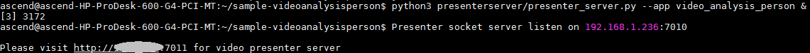

中文|[英文](README.md)

开发者将本Application部署至Atlas 200 DK或者AI加速云服务器上实现对本地mp4文件或者RTSP视频流进行解码，对视频帧中的行人和人脸进行检测并对其属性进行预测，生成结构化信息发送至Server端进行保存、展示的功能。

## 前提条件<a name="zh-cn_topic_0167343795_section137245294533"></a>

部署此Sample前，需要准备好以下环境：

-   已完成MindStudio的安装，详细请参考[Mind Studio安装指南](https://www.huawei.com/minisite/ascend/cn/filedetail_1.html)。
-   已完成Atlas 200 DK开发者板与Mind Studio的连接，交叉编译器的安装，SD卡的制作及基本信息的配置等，详细请参考[Atlas 200 DK使用指南](https://www.huawei.com/minisite/ascend/cn/filedetail_2.html)。

## 软件准备<a name="zh-cn_topic_0167343795_section8534138124114"></a>

运行此Sample前，需要按照此章节获取源码包，并进行相关的环境配置。

1.  获取源码包。

    将[https://github.com/Ascend/sample-videoanalysisperson](https://github.com/Ascend/sample-videoanalysisperson)仓中的代码以Mind Studio安装用户下载至Mind Studio所在Ubuntu服务器的任意目录，例如代码存放路径为：_/home/ascend/sample-videoanalysisperson_。

2.  以Mind Studio安装用户登录Mind Studio所在Ubuntu服务器，并设置环境变量DDK\_HOME。

    **vim \~/.bashrc**

    执行如下命令在最后一行添加DDK\_HOME及LD\_LIBRARY\_PATH的环境变量。

    **export DDK\_HOME=/home/XXX/tools/che/ddk/ddk**

    **export LD\_LIBRARY\_PATH=$DDK\_HOME/uihost/lib**

    > **说明：**   
    >-   XXX为Mind Studio安装用户，/home/XXX/tools为DDK默认安装路径。  
    >-   如果此环境变量已经添加，则此步骤可跳过。  

    输入:wq!保存退出。

    执行如下命令使环境变量生效。

    **source \~/.bashrc**


## 部署<a name="zh-cn_topic_0167343795_section1759513564117"></a>

1.  以Mind Studio安装用户进入videoanalysis应用代码所在根目录，如 _/home/ascend/sample-videoanalysisperson_。
2.  <a name="zh-cn_topic_0167343795_li08019112542"></a>执行部署脚本，进行工程环境准备，包括ascenddk公共库的编译与部署、网络模型的下载、Presenter Server服务器的配置等操作。

    **bash deploy.sh** _host\_ip_ _model\_mode_

    -   _host\_ip_：对于Atlas 200 DK开发者板，即为开发者板的IP地址。对于AI加速云服务器，即为Host侧的IP地址。

    -   model\_mode代表模型文件的部署方式，默认为internet。
        -   local：若Mind Studio所在Ubuntu系统未连接网络，请使用local模式，执行此命令前，需要参考[网络模型及依赖代码库下载](#zh-cn_topic_0167343795_section13807155164319)将模型文件及依赖代码库的下载到“/sample-videoanalysisperson/script“目录下。
        -   internet：在线部署，若Mind Studio所在Ubuntu系统已连接网络，请使用internet模式，在线下载模型文件。


    命令示例：

    **bash deploy.sh 192.168.1.2 internet**

    -   当提示“Please choose one to show the presenter in browser\(default: 127.0.0.1\):“时，请输入在浏览器中访问Presenter Server服务所使用的IP地址（一般为访问Mind Studio的IP地址）。
    -   当提示“Please input a absolute path to storage video analysis data:“时，请输入Mind Studio中已存在的绝对路径用于存储视频解析数据，此路径Mind Studio用户需要有读写权限。

    如[图1](#zh-cn_topic_0167343795_fig184321447181017)所示，请在“Current environment valid ip list“中选择通过浏览器访问Presenter Server服务使用的IP地址，并输入存储视频解析数据的路径。

    **图 1**  工程部署示意图<a name="zh-cn_topic_0167343795_fig184321447181017"></a>  
    

3.  <a name="zh-cn_topic_0167343795_li499911453439"></a>启动Presenter Server。

    执行如下命令在后台启动Video Analysis应用的Presenter Server主程序。

    **python3 presenterserver/presenter\_server.py --app video\_analysis\_person &**

    > **说明：**   
    >“presenter\_server.py“在当前目录的“presenterserve“目录下，可以在此目录下执行**python3 presenter\_server.py -h**或者**python3 presenter\_server.py --help**查看“presenter\_server.py“的使用方法。  

    如[图2](#zh-cn_topic_0167343795_fig69531305324)所示，表示presenter\_server的服务启动成功。

    **图 2**  Presenter Server进程启动<a name="zh-cn_topic_0167343795_fig69531305324"></a>  
    

    使用上图提示的URL登录Presenter Server（仅支持Chrome浏览器），IP地址为[2](#zh-cn_topic_0167343795_li08019112542)中输入的IP地址，端口号默为7011，如下图所示，表示Presenter Server启动成功。

    **图 3**  主页显示<a name="zh-cn_topic_0167343795_fig64391558352"></a>  
    

4.  视频结构化应用支持解析本地视频和RTSP视频流。
    -   如果需要解析本地视频，需要将视频文件传到Host侧。

        例如将视频文件person.mp4上传到Host侧的“/home/HwHiAiUser/sample“目录下。

        > **说明：**   
        >支持H264与H265格式的MP4文件，如果MP4文件需要剪辑，建议使用开源工具ffmpeg，使用其他工具剪辑的视频文件ffmpeg工具可能不支持解析。  

    -   如果仅解析RTSP视频流，本步骤可跳过。


## 运行<a name="zh-cn_topic_0167343795_section6245151616426"></a>

1.  运行Video Analysis程序。

    在“/home/ascend/sample-videoanalysisperson“目录下执行如下命令运行Video Analysis应用程序。

    **bash run\_videoanalysispersonapp.sh** _host\_ip_  _presenter\_view\_appname_ _channel1_ _\[channel2\]_   &

    -   _host\_ip_：对于Atlas 200 DK开发者板，即为开发者板的IP地址。对于AI加速云服务器，即为Host侧的IP地址。
    -   _presenter\_view\_app\_name_：用户自定义的在PresenterServer界面展示的View Name。
    -   _channel1_为Host侧的视频文件的绝对路径。
    -   _channel2_为RTSP视频流的URL。

    命令示例如下所示：

    **bash run\_videoanalysispersonapp.sh 192.168.1.2 video /home/HwHiAiUser/sample/person.mp4 &**

2.  使用启动Presenter Server服务时提示的URL登录 Presenter Server 网站（仅支持Chrome浏览器），详细可参考[3](#zh-cn_topic_0167343795_li499911453439)。

    > **说明：**   
    >Video Analysis的Presenter Server最多支持2个_presenter\_view\_app\_name_同时显示。  

    页面左侧树结构列出了视频所属app name以及通道名，中间列出了抽取的视频帧大图以及检测出的目标小图，点击下方小图后会在右侧列出详细的推理结果、评分。

    本应用支持人体属性检测和人脸属性检测。

    -   人体属性包括：

        Age：共分Age16-30，Age31-45，Age46-60，AgeAbove61四个年龄段; Backpack; CarryingOther; Casual lower; Casual upper; Formal lower; Hat; Jacket; Jeans; Leather Shoes; Logo; Short hair/Long hair; Male/Female; Messenger Bag; Muffler; No accessory; No carrying; Plaid; PlasticBags; Sandals; Shoes; Shorts; Short Sleeve; Skirt; Sneaker; Stripes; Sunglasses; Trousers; Tshirt; UpperOther; V-Neck。

        其中在视频分析界面的详细推理结果展示区域，Age、Male/Female、Short hair/Long hair是必展示属性，其他属性当置信度\>0.5时则展示，否则不展示。


    -   人脸属性检测支持年龄和性别的的识别。


## 后续处理<a name="zh-cn_topic_0167343795_section1092612277429"></a>

-   **停止人体检测应用**

    若要停止人体检测应用程序，可执行如下操作。

    以Mind Studio安装用户在sample-videoanalysisperson目录下执行如下命令：

    **bash stop\_videoanalysispersonapp.sh** _host\_ip_

    _host\_ip_：对于Atlas 200 DK开发者板，即为开发者板的IP地址。对于AI加速云服务器，即为Host的IP地址。。

    命令示例：

    **bash stop\_videoanalysispersonapp.sh** _192.168.1.2_

-   **停止Presenter Server服务**

    Presenter Server服务启动后会一直处于运行状态，若想停止视频结构化应用对应的Presenter Server服务，可执行如下操作。

    以Mind Studio安装用户在Mind Studio所在服务器中执行如下命令查看视频结构化应用对应的Presenter Server服务的进程。

    **ps -ef | grep presenter | grep video\_analysis\_person**

    ```
    ascend@ascend-HP-ProDesk-600-G4-PCI-MT:~/sample-videoanalysisperson$ ps -ef | grep presenter | grep video_analysis_car
    ascend 3656 20313 0 15:10 pts/24?? 00:00:00 python3 presenterserver/presenter_server.py --app video_analysis_person
    ```

    如上所示_3656_即为车辆检测应用对应的Presenter Server服务的进程ID。

    若想停止此服务，执行如下命令：

    **kill -9** _3656_


## 网络模型及依赖代码库下载<a name="zh-cn_topic_0167343795_section13807155164319"></a>

-   网络模型下载

    人体检测Application中使用的模型是经过转化后的适配Ascend 310芯片的模型，适配Ascend 310的模型的下载及原始网络模型的下载可参考[表1](#zh-cn_topic_0167343795_table0531392153)。如果您有更好的模型，欢迎上传到[https://github.com/Ascend/models](https://github.com/Ascend/models)进行分享。

    将模型文件（.om文件）下载到“sample-videoanalysisperson/script“目录下。

    **表 1**  开源Application中使用模型

    <a name="zh-cn_topic_0167343795_table0531392153"></a>
    <table><thead align="left"><tr id="zh-cn_topic_0167343795_row1154103991514"><th class="cellrowborder" valign="top" width="19.53%" id="mcps1.2.5.1.1"><p id="zh-cn_topic_0167343795_p195418397155"><a name="zh-cn_topic_0167343795_p195418397155"></a><a name="zh-cn_topic_0167343795_p195418397155"></a>模型名称</p>
    </th>
    <th class="cellrowborder" valign="top" width="29.970000000000002%" id="mcps1.2.5.1.2"><p id="zh-cn_topic_0167343795_p1054539151519"><a name="zh-cn_topic_0167343795_p1054539151519"></a><a name="zh-cn_topic_0167343795_p1054539151519"></a>模型说明</p>
    </th>
    <th class="cellrowborder" valign="top" width="32.01%" id="mcps1.2.5.1.3"><p id="zh-cn_topic_0167343795_p387083117108"><a name="zh-cn_topic_0167343795_p387083117108"></a><a name="zh-cn_topic_0167343795_p387083117108"></a>模型下载路径</p>
    </th>
    <th class="cellrowborder" valign="top" width="18.490000000000002%" id="mcps1.2.5.1.4"><p id="zh-cn_topic_0167343795_p35412397154"><a name="zh-cn_topic_0167343795_p35412397154"></a><a name="zh-cn_topic_0167343795_p35412397154"></a>原始网络下载地址</p>
    </th>
    </tr>
    </thead>
    <tbody><tr id="zh-cn_topic_0167343795_row12294113715478"><td class="cellrowborder" valign="top" width="19.53%" headers="mcps1.2.5.1.1 "><p id="zh-cn_topic_0167343795_p17544398153"><a name="zh-cn_topic_0167343795_p17544398153"></a><a name="zh-cn_topic_0167343795_p17544398153"></a>人脸检测网络模型</p>
    <p id="zh-cn_topic_0167343795_p84114461512"><a name="zh-cn_topic_0167343795_p84114461512"></a><a name="zh-cn_topic_0167343795_p84114461512"></a>（face_detection.om）</p>
    </td>
    <td class="cellrowborder" valign="top" width="29.970000000000002%" headers="mcps1.2.5.1.2 "><p id="zh-cn_topic_0167343795_p1372429181516"><a name="zh-cn_topic_0167343795_p1372429181516"></a><a name="zh-cn_topic_0167343795_p1372429181516"></a>基于Caffe的Resnet0-SSD300模型转换后的网络模型。</p>
    </td>
    <td class="cellrowborder" valign="top" width="32.01%" headers="mcps1.2.5.1.3 "><p id="zh-cn_topic_0167343795_p1569513572242"><a name="zh-cn_topic_0167343795_p1569513572242"></a><a name="zh-cn_topic_0167343795_p1569513572242"></a>请从<a href="https://github.com/Ascend/models/" target="_blank" rel="noopener noreferrer">https://github.com/Ascend/models/</a>仓的computer_vision/object_detect/<span>face_detection</span>目录中下载。</p>
    <p id="zh-cn_topic_0167343795_p1787118315101"><a name="zh-cn_topic_0167343795_p1787118315101"></a><a name="zh-cn_topic_0167343795_p1787118315101"></a>对应版本说明请参考当前目录下的<span>README.md</span>文件。</p>
    </td>
    <td class="cellrowborder" valign="top" width="18.490000000000002%" headers="mcps1.2.5.1.4 "><p id="zh-cn_topic_0167343795_p1785381617217"><a name="zh-cn_topic_0167343795_p1785381617217"></a><a name="zh-cn_topic_0167343795_p1785381617217"></a>请参考<a href="https://github.com/Ascend/models/" target="_blank" rel="noopener noreferrer">https://github.com/Ascend/models/</a>仓的computer_vision/object_detect/<span>face_detection</span>目录下的<span>README.md</span>文件获取。</p>
    <p id="zh-cn_topic_0167343795_p1314312124919"><a name="zh-cn_topic_0167343795_p1314312124919"></a><a name="zh-cn_topic_0167343795_p1314312124919"></a><strong id="zh-cn_topic_0167343795_b1141243104917"><a name="zh-cn_topic_0167343795_b1141243104917"></a><a name="zh-cn_topic_0167343795_b1141243104917"></a>模型转换时注意事项：</strong></p>
    <p id="zh-cn_topic_0167343795_p53116302463"><a name="zh-cn_topic_0167343795_p53116302463"></a><a name="zh-cn_topic_0167343795_p53116302463"></a>转化时会提示转化失败，只需要在最后一层的下拉框中选择SSDDetectionOutput然后点击Retry重新转换即可。</p>
    <p id="zh-cn_topic_0167343795_p2070918516450"><a name="zh-cn_topic_0167343795_p2070918516450"></a><a name="zh-cn_topic_0167343795_p2070918516450"></a><a name="zh-cn_topic_0167343795_image1725195313454"></a><a name="zh-cn_topic_0167343795_image1725195313454"></a><span></span></p>
    </td>
    </tr>
    <tr id="zh-cn_topic_0167343795_row12346165423420"><td class="cellrowborder" valign="top" width="19.53%" headers="mcps1.2.5.1.1 "><p id="zh-cn_topic_0167343795_p768019443514"><a name="zh-cn_topic_0167343795_p768019443514"></a><a name="zh-cn_topic_0167343795_p768019443514"></a>人体特征推理模型（pedestrian.om）</p>
    </td>
    <td class="cellrowborder" valign="top" width="29.970000000000002%" headers="mcps1.2.5.1.2 "><p id="zh-cn_topic_0167343795_p887812590385"><a name="zh-cn_topic_0167343795_p887812590385"></a><a name="zh-cn_topic_0167343795_p887812590385"></a>基于Caffe的VeSPA模型。</p>
    </td>
    <td class="cellrowborder" valign="top" width="32.01%" headers="mcps1.2.5.1.3 "><p id="zh-cn_topic_0167343795_p815140185614"><a name="zh-cn_topic_0167343795_p815140185614"></a><a name="zh-cn_topic_0167343795_p815140185614"></a>请从<a href="https://github.com/Ascend/models/" target="_blank" rel="noopener noreferrer">https://github.com/Ascend/models/</a>仓的computer_vision/classification/pedestrian目录中下载。</p>
    <p id="zh-cn_topic_0167343795_p12151140105620"><a name="zh-cn_topic_0167343795_p12151140105620"></a><a name="zh-cn_topic_0167343795_p12151140105620"></a>对应版本说明请参考当前目录下的<span>README.md</span>文件。</p>
    </td>
    <td class="cellrowborder" valign="top" width="18.490000000000002%" headers="mcps1.2.5.1.4 "><p id="zh-cn_topic_0167343795_p111534014560"><a name="zh-cn_topic_0167343795_p111534014560"></a><a name="zh-cn_topic_0167343795_p111534014560"></a>请参考<a href="https://github.com/Ascend/models/" target="_blank" rel="noopener noreferrer">https://github.com/Ascend/models/</a>仓的computer_vision/classification/pedestrian目录下的<span>README.md</span>文件获取。</p>
    </td>
    </tr>
    <tr id="zh-cn_topic_0167343795_row12462681048"><td class="cellrowborder" valign="top" width="19.53%" headers="mcps1.2.5.1.1 "><p id="zh-cn_topic_0167343795_p67609181917"><a name="zh-cn_topic_0167343795_p67609181917"></a><a name="zh-cn_topic_0167343795_p67609181917"></a>年龄识别网络模型（inception_age.om）</p>
    </td>
    <td class="cellrowborder" valign="top" width="29.970000000000002%" headers="mcps1.2.5.1.2 "><p id="zh-cn_topic_0167343795_p138799112017"><a name="zh-cn_topic_0167343795_p138799112017"></a><a name="zh-cn_topic_0167343795_p138799112017"></a>基于Tensorflow的Inception V3模型。</p>
    </td>
    <td class="cellrowborder" valign="top" width="32.01%" headers="mcps1.2.5.1.3 "><p id="zh-cn_topic_0167343795_p143172219204"><a name="zh-cn_topic_0167343795_p143172219204"></a><a name="zh-cn_topic_0167343795_p143172219204"></a>请从<a href="https://github.com/Ascend/models/" target="_blank" rel="noopener noreferrer">https://github.com/Ascend/models/</a>仓的computer_vision/classification/inception_age目录中下载。</p>
    <p id="zh-cn_topic_0167343795_p53182210209"><a name="zh-cn_topic_0167343795_p53182210209"></a><a name="zh-cn_topic_0167343795_p53182210209"></a>对应版本说明请参考当前目录下的<span>README.md</span>文件。</p>
    </td>
    <td class="cellrowborder" valign="top" width="18.490000000000002%" headers="mcps1.2.5.1.4 "><p id="zh-cn_topic_0167343795_p47600161920"><a name="zh-cn_topic_0167343795_p47600161920"></a><a name="zh-cn_topic_0167343795_p47600161920"></a>请参考<a href="https://github.com/Ascend/models/" target="_blank" rel="noopener noreferrer">https://github.com/Ascend/models/</a>仓的computer_vision/classification/inception_age目录下的<span>README.md</span>文件获取。</p>
    <p id="zh-cn_topic_0167343795_p1994592941515"><a name="zh-cn_topic_0167343795_p1994592941515"></a><a name="zh-cn_topic_0167343795_p1994592941515"></a><strong id="zh-cn_topic_0167343795_b13946182919155"><a name="zh-cn_topic_0167343795_b13946182919155"></a><a name="zh-cn_topic_0167343795_b13946182919155"></a>模型转换时注意事项：</strong></p>
    <p id="zh-cn_topic_0167343795_p12946229111515"><a name="zh-cn_topic_0167343795_p12946229111515"></a><a name="zh-cn_topic_0167343795_p12946229111515"></a>age_inference一次处理10张图片，所以转换时需要将Input Shape的N修改为10。</p>
    </td>
    </tr>
    <tr id="zh-cn_topic_0167343795_row1438610219151"><td class="cellrowborder" valign="top" width="19.53%" headers="mcps1.2.5.1.1 "><p id="zh-cn_topic_0167343795_p672814672011"><a name="zh-cn_topic_0167343795_p672814672011"></a><a name="zh-cn_topic_0167343795_p672814672011"></a>性别识别网络模型（inception_gender.om）</p>
    </td>
    <td class="cellrowborder" valign="top" width="29.970000000000002%" headers="mcps1.2.5.1.2 "><p id="zh-cn_topic_0167343795_p281361717216"><a name="zh-cn_topic_0167343795_p281361717216"></a><a name="zh-cn_topic_0167343795_p281361717216"></a>基于Tensorflow的Inception V3模型。</p>
    </td>
    <td class="cellrowborder" valign="top" width="32.01%" headers="mcps1.2.5.1.3 "><p id="zh-cn_topic_0167343795_p1310692316215"><a name="zh-cn_topic_0167343795_p1310692316215"></a><a name="zh-cn_topic_0167343795_p1310692316215"></a>请从<a href="https://github.com/Ascend/models/" target="_blank" rel="noopener noreferrer">https://github.com/Ascend/models/</a>仓的computer_vision/classification/inception_gender目录中下载。</p>
    <p id="zh-cn_topic_0167343795_p1610632315215"><a name="zh-cn_topic_0167343795_p1610632315215"></a><a name="zh-cn_topic_0167343795_p1610632315215"></a>对应版本说明请参考当前目录下的<span>README.md</span>文件。</p>
    </td>
    <td class="cellrowborder" valign="top" width="18.490000000000002%" headers="mcps1.2.5.1.4 "><p id="zh-cn_topic_0167343795_p272824618207"><a name="zh-cn_topic_0167343795_p272824618207"></a><a name="zh-cn_topic_0167343795_p272824618207"></a>请参考<a href="https://github.com/Ascend/models/" target="_blank" rel="noopener noreferrer">https://github.com/Ascend/models/</a>仓的computer_vision/classification/inception_gender目录下的<span>README.md</span>文件获取。</p>
    <p id="zh-cn_topic_0167343795_p14151414182015"><a name="zh-cn_topic_0167343795_p14151414182015"></a><a name="zh-cn_topic_0167343795_p14151414182015"></a><strong id="zh-cn_topic_0167343795_b121512142204"><a name="zh-cn_topic_0167343795_b121512142204"></a><a name="zh-cn_topic_0167343795_b121512142204"></a>模型转换时注意事项：</strong></p>
    <p id="zh-cn_topic_0167343795_p515101492012"><a name="zh-cn_topic_0167343795_p515101492012"></a><a name="zh-cn_topic_0167343795_p515101492012"></a>gender_inference一次处理10张图片，所以转换时需要将Input Shape的N修改为10。</p>
    </td>
    </tr>
    <tr id="zh-cn_topic_0167343795_row15233104034916"><td class="cellrowborder" valign="top" width="19.53%" headers="mcps1.2.5.1.1 "><p id="zh-cn_topic_0167343795_p671932965015"><a name="zh-cn_topic_0167343795_p671932965015"></a><a name="zh-cn_topic_0167343795_p671932965015"></a>目标检测网络模型</p>
    <p id="zh-cn_topic_0167343795_p267913419353"><a name="zh-cn_topic_0167343795_p267913419353"></a><a name="zh-cn_topic_0167343795_p267913419353"></a>（vgg_ssd.om）</p>
    </td>
    <td class="cellrowborder" valign="top" width="29.970000000000002%" headers="mcps1.2.5.1.2 "><p id="zh-cn_topic_0167343795_p1668310475389"><a name="zh-cn_topic_0167343795_p1668310475389"></a><a name="zh-cn_topic_0167343795_p1668310475389"></a>基于Caffe的SSD512模型。</p>
    </td>
    <td class="cellrowborder" valign="top" width="32.01%" headers="mcps1.2.5.1.3 "><p id="zh-cn_topic_0167343795_p384510355555"><a name="zh-cn_topic_0167343795_p384510355555"></a><a name="zh-cn_topic_0167343795_p384510355555"></a>请从<a href="https://github.com/Ascend/models/" target="_blank" rel="noopener noreferrer">https://github.com/Ascend/models/</a>仓的computer_vision/object_detect/vgg_ssd目录中下载。</p>
    <p id="zh-cn_topic_0167343795_p13845123525511"><a name="zh-cn_topic_0167343795_p13845123525511"></a><a name="zh-cn_topic_0167343795_p13845123525511"></a>对应版本说明请参考当前目录下的<span>README.md</span>文件。</p>
    </td>
    <td class="cellrowborder" valign="top" width="18.490000000000002%" headers="mcps1.2.5.1.4 "><p id="zh-cn_topic_0167343795_p18846153545510"><a name="zh-cn_topic_0167343795_p18846153545510"></a><a name="zh-cn_topic_0167343795_p18846153545510"></a>请参考<a href="https://github.com/Ascend/models/" target="_blank" rel="noopener noreferrer">https://github.com/Ascend/models/</a>仓的computer_vision/object_detect/vgg_ssd目录下的<span>README.md</span>文件获取。</p>
    </td>
    </tr>
    </tbody>
    </table>

-   依赖代码库下载

    将依赖的软件库下载到“sample-videoanalysisperson/script“目录下。

    **表 2**  依赖代码库下载

    <a name="zh-cn_topic_0167343795_table188713302242"></a>
    <table><thead align="left"><tr id="zh-cn_topic_0167343795_row108861130152414"><th class="cellrowborder" valign="top" width="33.33333333333333%" id="mcps1.2.4.1.1"><p id="zh-cn_topic_0167343795_p188861430152417"><a name="zh-cn_topic_0167343795_p188861430152417"></a><a name="zh-cn_topic_0167343795_p188861430152417"></a>模块名称</p>
    </th>
    <th class="cellrowborder" valign="top" width="33.33333333333333%" id="mcps1.2.4.1.2"><p id="zh-cn_topic_0167343795_p118861030172415"><a name="zh-cn_topic_0167343795_p118861030172415"></a><a name="zh-cn_topic_0167343795_p118861030172415"></a>模块描述</p>
    </th>
    <th class="cellrowborder" valign="top" width="33.33333333333333%" id="mcps1.2.4.1.3"><p id="zh-cn_topic_0167343795_p1688616307242"><a name="zh-cn_topic_0167343795_p1688616307242"></a><a name="zh-cn_topic_0167343795_p1688616307242"></a>下载地址</p>
    </th>
    </tr>
    </thead>
    <tbody><tr id="zh-cn_topic_0167343795_row16886193072418"><td class="cellrowborder" valign="top" width="33.33333333333333%" headers="mcps1.2.4.1.1 "><p id="zh-cn_topic_0167343795_p38861730182415"><a name="zh-cn_topic_0167343795_p38861730182415"></a><a name="zh-cn_topic_0167343795_p38861730182415"></a>EZDVPP</p>
    </td>
    <td class="cellrowborder" valign="top" width="33.33333333333333%" headers="mcps1.2.4.1.2 "><p id="zh-cn_topic_0167343795_p88861830112417"><a name="zh-cn_topic_0167343795_p88861830112417"></a><a name="zh-cn_topic_0167343795_p88861830112417"></a>对DVPP接口进行了封装，提供对图片/视频的处理能力。</p>
    </td>
    <td class="cellrowborder" valign="top" width="33.33333333333333%" headers="mcps1.2.4.1.3 "><p id="zh-cn_topic_0167343795_p58861930152414"><a name="zh-cn_topic_0167343795_p58861930152414"></a><a name="zh-cn_topic_0167343795_p58861930152414"></a><a href="https://github.com/Ascend/sdk-ezdvpp" target="_blank" rel="noopener noreferrer">https://github.com/Ascend/sdk-ezdvpp</a></p>
    <p id="zh-cn_topic_0167343795_p288633010241"><a name="zh-cn_topic_0167343795_p288633010241"></a><a name="zh-cn_topic_0167343795_p288633010241"></a>下载后请保持文件夹名称为ezdvpp。</p>
    </td>
    </tr>
    <tr id="zh-cn_topic_0167343795_row10886730182420"><td class="cellrowborder" valign="top" width="33.33333333333333%" headers="mcps1.2.4.1.1 "><p id="zh-cn_topic_0167343795_p18886183018246"><a name="zh-cn_topic_0167343795_p18886183018246"></a><a name="zh-cn_topic_0167343795_p18886183018246"></a>Presenter Agent</p>
    </td>
    <td class="cellrowborder" valign="top" width="33.33333333333333%" headers="mcps1.2.4.1.2 "><p id="zh-cn_topic_0167343795_p1088663019246"><a name="zh-cn_topic_0167343795_p1088663019246"></a><a name="zh-cn_topic_0167343795_p1088663019246"></a>与Presenter Server进行交互的API接口。</p>
    </td>
    <td class="cellrowborder" valign="top" width="33.33333333333333%" headers="mcps1.2.4.1.3 "><p id="zh-cn_topic_0167343795_p1988683012245"><a name="zh-cn_topic_0167343795_p1988683012245"></a><a name="zh-cn_topic_0167343795_p1988683012245"></a><a href="https://github.com/Ascend/sdk-presenter/tree/master/presenteragent" target="_blank" rel="noopener noreferrer">https://github.com/Ascend/sdk-presenter/tree/master/presenteragent</a></p>
    <p id="zh-cn_topic_0167343795_p10886230182416"><a name="zh-cn_topic_0167343795_p10886230182416"></a><a name="zh-cn_topic_0167343795_p10886230182416"></a>下载后请保持文件夹名称为presenteragent。</p>
    </td>
    </tr>
    <tr id="zh-cn_topic_0167343795_row38874306249"><td class="cellrowborder" valign="top" width="33.33333333333333%" headers="mcps1.2.4.1.1 "><p id="zh-cn_topic_0167343795_p188619304247"><a name="zh-cn_topic_0167343795_p188619304247"></a><a name="zh-cn_topic_0167343795_p188619304247"></a>开源工具ffmpeg</p>
    </td>
    <td class="cellrowborder" valign="top" width="33.33333333333333%" headers="mcps1.2.4.1.2 "><p id="zh-cn_topic_0167343795_p1688693015245"><a name="zh-cn_topic_0167343795_p1688693015245"></a><a name="zh-cn_topic_0167343795_p1688693015245"></a>实现对视频文件的解封</p>
    </td>
    <td class="cellrowborder" valign="top" width="33.33333333333333%" headers="mcps1.2.4.1.3 "><p id="zh-cn_topic_0167343795_p18886183072412"><a name="zh-cn_topic_0167343795_p18886183072412"></a><a name="zh-cn_topic_0167343795_p18886183072412"></a>ffmpeg 4.0代码下载地址：<a href="https://github.com/FFmpeg/FFmpeg/tree/release/4.0" target="_blank" rel="noopener noreferrer">https://github.com/FFmpeg/FFmpeg/tree/release/4.0</a>。</p>
    <p id="zh-cn_topic_0167343795_p78860308246"><a name="zh-cn_topic_0167343795_p78860308246"></a><a name="zh-cn_topic_0167343795_p78860308246"></a>下载后，目录名称请使用ffmpeg。</p>
    </td>
    </tr>
    <tr id="zh-cn_topic_0167343795_row1388793011241"><td class="cellrowborder" valign="top" width="33.33333333333333%" headers="mcps1.2.4.1.1 "><p id="zh-cn_topic_0167343795_p088703013241"><a name="zh-cn_topic_0167343795_p088703013241"></a><a name="zh-cn_topic_0167343795_p088703013241"></a>tornado (5.1.0)</p>
    <p id="zh-cn_topic_0167343795_p28871930112419"><a name="zh-cn_topic_0167343795_p28871930112419"></a><a name="zh-cn_topic_0167343795_p28871930112419"></a>protobuf (3.5.1)</p>
    <p id="zh-cn_topic_0167343795_p28871230102413"><a name="zh-cn_topic_0167343795_p28871230102413"></a><a name="zh-cn_topic_0167343795_p28871230102413"></a>numpy (1.14.2)</p>
    </td>
    <td class="cellrowborder" valign="top" width="33.33333333333333%" headers="mcps1.2.4.1.2 "><p id="zh-cn_topic_0167343795_p0887153052413"><a name="zh-cn_topic_0167343795_p0887153052413"></a><a name="zh-cn_topic_0167343795_p0887153052413"></a>Presenter Server依赖的Python库</p>
    </td>
    <td class="cellrowborder" valign="top" width="33.33333333333333%" headers="mcps1.2.4.1.3 "><p id="zh-cn_topic_0167343795_p9887193012248"><a name="zh-cn_topic_0167343795_p9887193012248"></a><a name="zh-cn_topic_0167343795_p9887193012248"></a>请自行搜索相关源进行安装。</p>
    </td>
    </tr>
    </tbody>
    </table>


